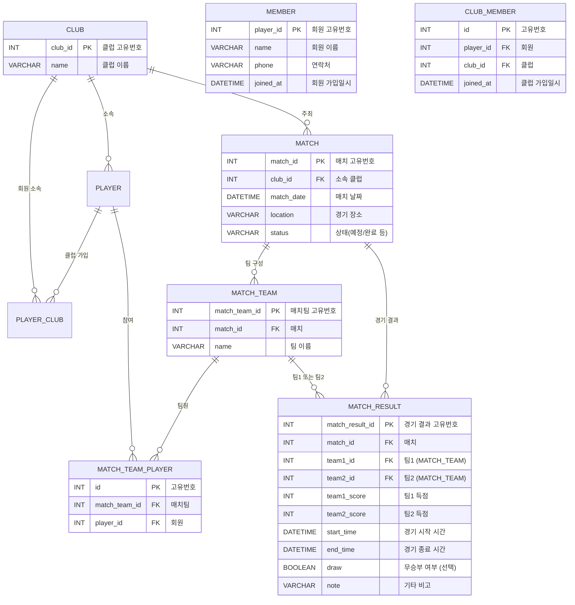

# ERD

```mermaid
    erDiagram
    CLUB {
        INT club_id PK "클럽 고유번호"
        VARCHAR name "클럽 이름"
    }

    MEMBER {
        INT player_id PK "회원 고유번호"
        VARCHAR name "회원 이름"
        VARCHAR phone "연락처"
        DATETIME joined_at "회원 가입일시"
    }

   CLUB_MEMBER {
        INT id PK "고유번호"
        INT player_id FK "회원"
        INT club_id FK "클럽"
        DATETIME joined_at "클럽 가입일시"
    }

    CLUB ||--o{ PLAYER_CLUB : "회원 소속"
    PLAYER ||--o{ PLAYER_CLUB : "클럽 가입"
    
        MATCH {
            INT match_id PK "매치 고유번호"
            INT club_id FK "소속 클럽"
            DATETIME match_date "매치 날짜"
            VARCHAR location "경기 장소"
            VARCHAR status "상태(예정/완료 등)"
        }
    
        MATCH_TEAM {
            INT match_team_id PK "매치팀 고유번호"
            INT match_id FK "매치"
            VARCHAR name "팀 이름"
        }
    
        MATCH_TEAM_PLAYER {
            INT id PK "고유번호"
            INT match_team_id FK "매치팀"
            INT player_id FK "회원"
        }
    
        MATCH_RESULT {
            INT match_result_id PK "경기 결과 고유번호"
            INT match_id FK "매치"
            INT team1_id FK "팀1 (MATCH_TEAM)"
            INT team2_id FK "팀2 (MATCH_TEAM)"
            INT team1_score "팀1 득점"
            INT team2_score "팀2 득점"
            DATETIME start_time "경기 시작 시간"
            DATETIME end_time "경기 종료 시간"
            BOOLEAN draw "무승부 여부 (선택)"
            VARCHAR note "기타 비고"
        }
    
        CLUB ||--o{ PLAYER : "소속"
        CLUB ||--o{ MATCH : "주최"
        MATCH ||--o{ MATCH_TEAM : "팀 구성"
        MATCH_TEAM ||--o{ MATCH_TEAM_PLAYER : "팀원"
        PLAYER ||--o{ MATCH_TEAM_PLAYER : "참여"
        MATCH ||--o{ MATCH_RESULT : "경기 결과"
        MATCH_TEAM ||--o{ MATCH_RESULT : "팀1 또는 팀2"
```
