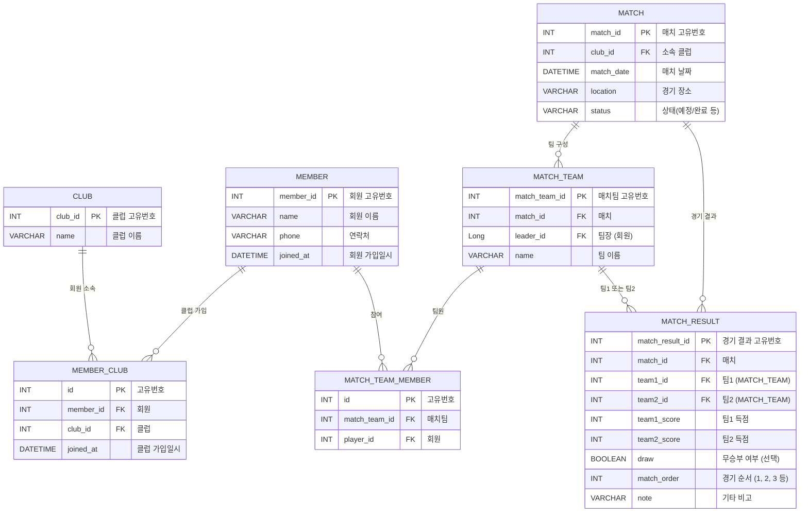

# ERD

```mermaid
    erDiagram
        CLUB {
            INT club_id PK "클럽 고유번호"
            VARCHAR name "클럽 이름"
        }
    
        MEMBER {
            INT member_id PK "회원 고유번호"
            VARCHAR name "회원 이름"
            VARCHAR phone "연락처"
            DATETIME joined_at "회원 가입일시"
        }
    
       MEMBER_CLUB {
            INT id PK "고유번호"
            INT member_id FK "회원"
            INT club_id FK "클럽"
            DATETIME joined_at "클럽 가입일시"
        }
 
        MATCH {
            INT match_id PK "매치 고유번호"
            INT club_id FK "소속 클럽"
            DATETIME match_date "매치 날짜"
            VARCHAR location "경기 장소"
            VARCHAR status "상태(예정/완료 등)"
        }
    
        MATCH_TEAM {
            INT match_team_id PK "매치팀 고유번호"
            INT match_id FK "매치"
            Long leader_id FK "팀장 (회원)"
            VARCHAR name "팀 이름"
        }
    
        MATCH_TEAM_MEMBER {
            INT id PK "고유번호"
            INT match_team_id FK "매치팀"
            INT player_id FK "회원"
        }
    
        MATCH_RESULT {
            INT match_result_id PK "경기 결과 고유번호"
            INT match_id FK "매치"
            INT team1_id FK "팀1 (MATCH_TEAM)"
            INT team2_id FK "팀2 (MATCH_TEAM)"
            INT team1_score "팀1 득점"
            INT team2_score "팀2 득점"
            BOOLEAN draw "무승부 여부 (선택)"
            INT match_order "경기 순서 (1, 2, 3 등)" 
            VARCHAR note "기타 비고"
        }

        CLUB ||--o{ MEMBER_CLUB : "회원 소속"
        MEMBER ||--o{ MEMBER_CLUB : "클럽 가입"
        MATCH ||--o{ MATCH_TEAM : "팀 구성"
        MATCH_TEAM ||--o{ MATCH_TEAM_MEMBER : "팀원"
        MEMBER ||--o{ MATCH_TEAM_MEMBER : "참여"
        MATCH ||--o{ MATCH_RESULT : "경기 결과"
        MATCH_TEAM ||--o{ MATCH_RESULT : "팀1 또는 팀2"
```
