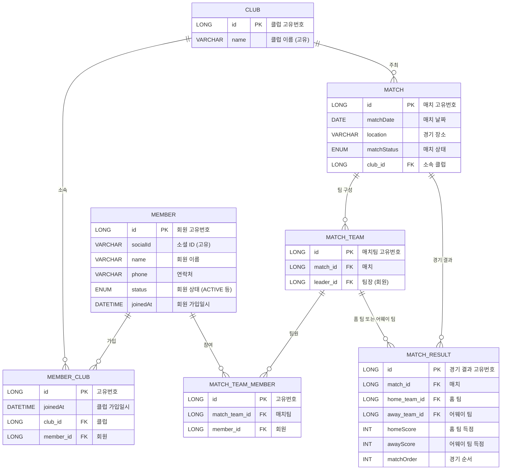

# ERD

```mermaid
    erDiagram
        MEMBER {
            LONG id PK "회원 고유번호"
            VARCHAR socialId "소셜 ID (고유)"
            VARCHAR name "회원 이름"
            VARCHAR phone "연락처"
            ENUM status "회원 상태 (ACTIVE 등)"
            DATETIME joinedAt "회원 가입일시"
        }
    
        CLUB {
            LONG id PK "클럽 고유번호"
            VARCHAR name "클럽 이름 (고유)"
        }
    
        MEMBER_CLUB {
            LONG id PK "고유번호"
            DATETIME joinedAt "클럽 가입일시"
            LONG club_id FK "클럽"
            LONG member_id FK "회원"
        }
    
        MATCH {
            LONG id PK "매치 고유번호"
            DATE matchDate "매치 날짜"
            VARCHAR location "경기 장소"
            ENUM matchStatus "매치 상태"
            LONG club_id FK "소속 클럽"
        }
    
        MATCH_TEAM {
            LONG id PK "매치팀 고유번호"
            LONG match_id FK "매치"
            LONG leader_id FK "팀장 (회원)"
        }
    
        MATCH_TEAM_MEMBER {
            LONG id PK "고유번호"
            LONG match_team_id FK "매치팀"
            LONG member_id FK "회원"
        }
    
        MATCH_RESULT {
            LONG id PK "경기 결과 고유번호"
            LONG match_id FK "매치"
            LONG home_team_id FK "홈 팀"
            LONG away_team_id FK "어웨이 팀"
            INT homeScore "홈 팀 득점"
            INT awayScore "어웨이 팀 득점"
            INT matchOrder "경기 순서"
        }
    
        MEMBER ||--o{ MEMBER_CLUB : "가입"
        CLUB ||--o{ MEMBER_CLUB : "소속"
        CLUB ||--o{ MATCH : "주최"
        MATCH ||--o{ MATCH_TEAM : "팀 구성"
        MATCH_TEAM ||--o{ MATCH_TEAM_MEMBER : "팀원"
        MEMBER ||--o{ MATCH_TEAM_MEMBER : "참여"
        MATCH ||--o{ MATCH_RESULT : "경기 결과"
        MATCH_TEAM ||--o{ MATCH_RESULT : "홈 팀 또는 어웨이 팀"
```
